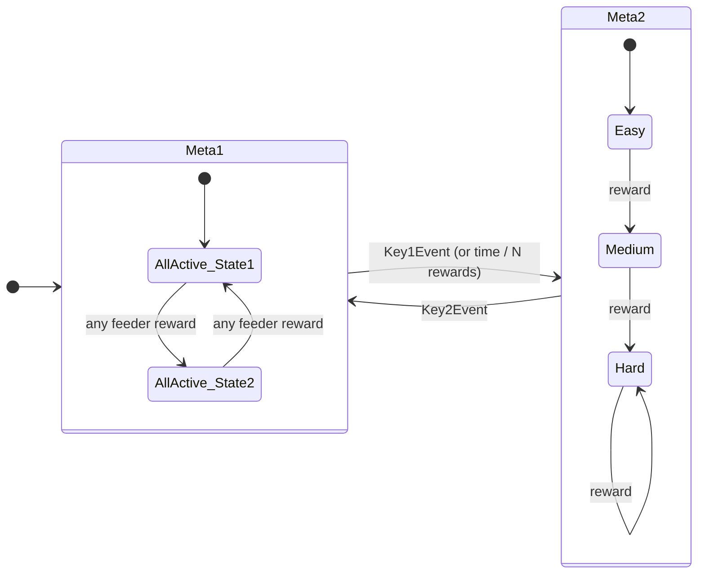

# Configuring the feeder task

This is the *mental model* for the feeder task — how the pieces fit together and
how to think about designing an experiment. It complements two things rather than
repeating them:

- the **schema** (the `# yaml-language-server: $schema=…` headers) tells you, field
  by field, *what each value means* — hover any key in VS Code;
- [`ABCDStatePlayer.md`](ABCDStatePlayer.md) is the technical reconstruction of the
  underlying Bonsai state-player.

Here we care about the *why* and the *how to shape behaviour*, not the field types.

## The one-sentence idea

An animal works at a feeder (running a wheel); when it has worked "enough" it gets
a pellet; **what counts as "enough" — and which feeders are even active — is decided
by a little state machine you write in YAML**, and that machine can change over the
course of a session.

## Two levels: the schedule and the game

The configuration is deliberately split into two layers. Keeping them straight is
the single most useful thing to understand.

| Layer | Lives in | Think of it as | Changes on the scale of |
| --- | --- | --- | --- |
| **Meta-controller** (`feederTask` in `HtsLoomTask.yaml`) | the task config | the **session schedule** — *which game is being played right now* | minutes–hours (or a keypress) |
| **Rule / `ForagingController`** (`Rule*.yaml`) | its own file | the **game itself** — *what the animal experiences moment to moment* | seconds (each reward) |

A useful analogy: the **meta-controller is the season schedule** (which match is on,
and when to move to the next), and each **rule file is the rulebook for one match**.
The meta-controller never touches an animal directly — it just decides which rulebook
is in force and swaps it when some condition is met.

> Cross-reference: foraging ABC's docs call the **rule file "Level 2"** and the
> **meta-controller "Level 3."** Same idea, different labels — useful when reading
> [`ABCDStatePlayer.md`](ABCDStatePlayer.md) or the foraging examples.

## Picture it

The whole task is a state machine *inside* a state machine: meta-states (the schedule)
contain rules, and each rule is a graph of states that the animal walks by earning
rewards.



Outer transitions (`Meta1 → Meta2`) are the **meta-controller** switching rules; inner
transitions are **rewards** moving the animal through a rule's states. `Meta1` here is
the "hold steady" baseline (`Rule1_AllActive`); `Meta2` sketches an escalation rule.

### The meta-controller (the schedule)

`feederTask` is a set of **meta-states**, each naming a rule file plus the
**transitions** that move to the next meta-state. A transition can fire on:

- a **keypress** (`activationEvent: Key1Event`) — manual control during a session;
- **elapsed time** in the meta-state;
- **number of rewards** delivered;
- **number of inner state transitions**.

While a meta-state runs, the controller keeps running tallies — **time in this
meta-state** and **rewards delivered so far** — which is exactly what the time/reward
transitions test against. Those tallies **reset to zero on every switch**, and each
switch is **logged** (which meta-state, when, and the transition that fired) to the
`StateLog_*` files. So think of each meta-state as a *fresh accounting period*, not a
running total across the whole session.

> The meta-controller is *only* a switcher. If a meta-state has **no transitions it
> can never leave — and in fact the state player treats "nothing to wait for" as
> "done" and ends it.** Always give a meta-state at least one transition (even just a
> manual key) unless you truly want it to be terminal. This is the most common
> first-config mistake.

### The rule (the game)

A rule (`ForagingController`) is a set of **states**, and each state describes, **per
feeder**, the behaviour the animal meets:

- `behavior`: is this feeder `Reward`ing or `Inactive` right now;
- `rewardRule`: how much wheel distance earns a pellet (`distanceThreshold`), how long
  of a pause resets that distance (`inactivityTimeout`), and **`nextState` — the state
  to jump to after this feeder pays out**;
- `led`: whether the cue light is on.

The whole behavioural texture of an experiment comes from **how states point at each
other through `nextState`.** That chaining is the lever you design with.

## How progression actually happens

1. The player loads the current rule and starts in its `startState`.
2. The animal runs a wheel; distance accumulates for that feeder.
3. When distance crosses `distanceThreshold`, a pellet is delivered.
4. The player then loads that feeder's `nextState` — and play continues from there.

So a state is not a fixed setting; it's a **node in a graph**, and a reward is the
edge you traverse. Design = drawing that graph.

### Three shapes you can draw

- **Hold steady** — every state's `nextState` is "stay the same" (or a 2-state ping-pong
  with identical thresholds). Difficulty never changes. This is `Rule1_AllActive`.
- **Win-switch** — after a feeder rewards, jump to a state where *that* feeder is
  `Inactive` and the others stay active, nudging the animal to move on.
- **Escalation ("gets harder")** — chain states with rising thresholds
  (`Easy → Medium → Hard → …`), so each pellet makes the next one cost more.

## The important caveat: one machine, shared by all feeders

Right now there is a **single, global current-state** shared by every feeder. When
*any* feeder rewards and moves to its `nextState`, **all** feeders move with it. That
is perfect for a single animal foraging across feeders, or for deliberately
*synchronised* difficulty.

It is **not** four independent animals. For the 4-mouse arena (one mouse per
screen/feeder) where each animal should progress on its own, the plan is **four
independent state players, one per feeder** — see the project notes. Until that lands,
treat "gets harder per feeder, independently" as not yet expressible: a global
escalation (harder for everyone with each pellet) is the honest approximation.

## Worked example: `Rule1_AllActive`

```yaml
startState: AllActive_State1
states:
  AllActive_State1:
    patchStates:
      Feeder1: { behavior: Reward, rewardRule: { distanceThreshold: 50, ..., nextState: AllActive_State2 }, ... }
      # Feeder2-4 identical
  AllActive_State2:
    patchStates:
      Feeder1: { ..., nextState: AllActive_State1 }
      # Feeder2-4 identical
```

Read it as: *all four feeders reward at a fixed 50-unit threshold, forever.* The two
states just ping-pong (`State1 → State2 → State1 …`) with the same settings — a clean
"always on, constant difficulty" baseline. To make it a real protocol you change what
`nextState` points at and how the thresholds/behaviours differ between states.

## A few practical anchors

- **Feeder names** (`Feeder1…4`) must match the rig (`HtsLoomRig.yaml`) — currently one
  feeder per screen.
- **Event names** (`Key1Event`, `ZoneTrigger1`, …) are the shared `EventName` set; a
  transition's `activationEvent` must be one of them, and keys are mapped in
  `InputKeys.bonsai`.
- **Rule files are loaded relative to the working directory** the workflow runs from
  (it resolves `<workingDir>/<stateFile>`), so launch from `src/` (or your deploy dir).
- Editing in VS Code with the schema header active gives you autocomplete and catches
  typos before the rig does — lean on it.
