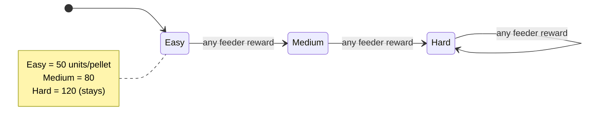
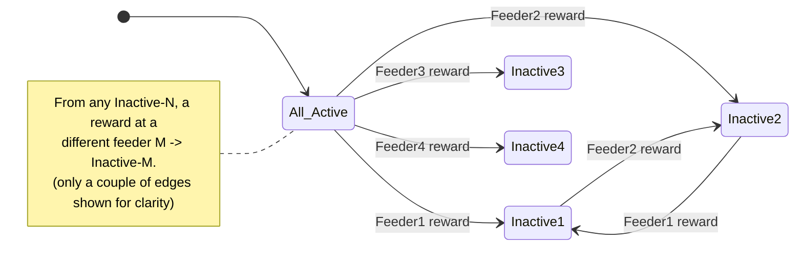

# Example feeder rules

Ready-to-copy `ForagingController` rule files, each with a diagram, to use as starting
points. See **[../FeederTask.md](../FeederTask.md)** for the underlying concepts.

> **Attribution.** These examples follow patterns and state-diagrams originally
> authored by **Adrian Roggenbach** (`a.roggenbach@ucl.ac.uk`) in the
> [`aeon_exp_foragingABC`](https://github.com/SainsburyWellcomeCentre/aeon_exp_foragingABC)
> repository, under `docs/example_RewardSwitch/` and `docs/example_sequence_of_three/`.
> Adrian's originals are early design sketches in a notation of their own; the files
> here are **reformatted to the implemented htsloom `ForagingController` schema**
> (4 feeders, one per screen) and validated against it. Credit for the *designs* is his.

## Using an example

1. Copy the `.yaml` into `../../src/` (next to `Rule1_AllActive.yaml`).
2. Point a meta-state at it in `HtsLoomTask.yaml`:
   ```yaml
   feederTask:
     startState: State_1
     metaStates:
       State_1:
         stateFile: Escalation.yaml      # or RewardSwitch.yaml
         transitions:
           - targetState: State_2
             activationEvent: Key1Event
       State_2:
         stateFile: RewardSwitch.yaml
         transitions:
           - targetState: State_1
             activationEvent: Key2Event
   ```
   (every meta-state needs at least one transition — see ../FeederTask.md).

---

## `Escalation.yaml` — "gets harder"

Each pellet (by any feeder) raises the wheel distance required for the next one, for
the whole rig, capping at the hardest level.



Global escalation (single shared state). True independent per-feeder ramps need the
per-feeder players — see ../FeederTask.md.

## `RewardSwitch.yaml` — "win-switch"

Once a feeder delivers a pellet it goes **Inactive**; the others stay active, pushing
the animal to a different feeder. The most-recently-rewarded feeder is the inactive one.


